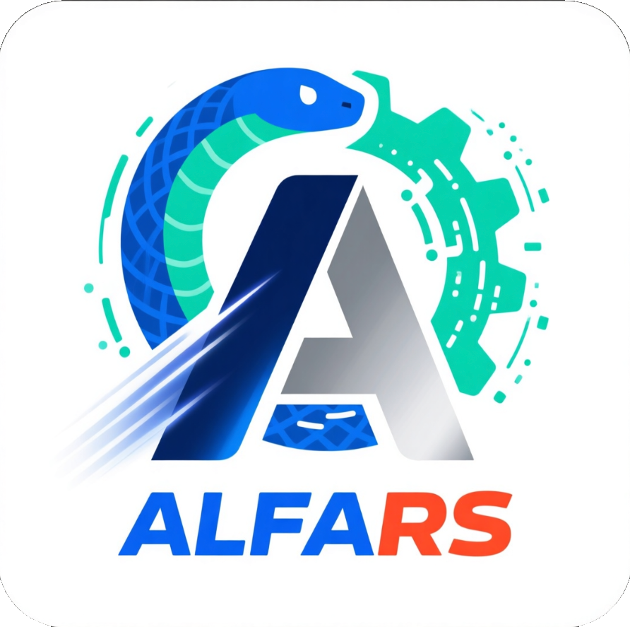

# alfars

<p align="center">
  
</p>

High-performance factor expression and backtesting framework with Rust core and Python bindings.

[](https://github.com/EthanNOV56/alfa.rs/actions)
[](https://pypi.org/project/alfars/)
[](https://opensource.org/licenses/MIT)

## Features

### Core Backtesting
- **High Performance**: Rust core with parallel computation (8-10x speedup)
- **Flexible API**: NumPy arrays and Pandas Series support
- **Complete Features**: qcut(N) grouping, long-short portfolios, IC calculation, factor analysis
- **Alphalens Compatibility**: Similar API design for easy migration
- **Extensible**: Modular design with custom weights, grouping, and commission models

### Intelligent Factor Mining (v0.4.0)
- **Expression System**: AST-based expression builder for custom factor computation
- **Lazy Evaluation**: Polars-style delayed computation with query optimization
- **Genetic Programming**: Auto-discover high-performance factor expressions
- **Dimension System**: Type-safe factor expressions to prevent invalid calculations
- **Persistence**: Factor library management with search, caching, and versioning
- **Meta-Learning**: Intelligent GP parameter recommendations based on historical data

### Interactive Lab (v0.4.0)
- **One-Command Launch**: `alfars lab` starts all services automatically
- **Visual Backtest**: Interactive charts for NAV, IC, and quantile returns
- **Browser-based**: Access via http://localhost:5173
- **ClickHouse Support**: Connect to ClickHouse for historical market data

## Installation

### Requirements

- **Rust**: 1.70+ (`curl --proto '=https' --tlsv1.2 -sSf https://sh.rustup.rs | sh`)
- **Python**: 3.8+
- **uv** (recommended): `pip install uv`

### Install from Source

```bash
# Clone repository
git clone https://github.com/EthanNOV56/alfa.rs.git
cd alfa.rs

# Option 1: Full installation with Python bindings
uv pip install -e .
maturin develop --release

# Option 2: Rust-only server (no Python extension needed)
cargo build --release --bin alfars-server
```

### Using pip (future releases)

```bash
pip install alfars
```

## Quick Start

### Basic Usage

```python
import numpy as np
import alfars as al

# Generate sample data
n_days, n_assets = 100, 200
factor = np.random.randn(n_days, n_assets)
returns = np.random.randn(n_days, n_assets) * 0.01 + factor * 0.005

# Run quantile backtest
result = al.quantile_backtest(
    factor=factor,
    returns=returns,
    quantiles=10,
    weight_method="equal",
    long_top_n=1,
    short_top_n=1,
    commission_rate=0.0003,
)

print(f"Long-Short Return: {result.long_short_cum_return:.4%}")
print(f"IC Mean: {result.ic_mean:.4f}")
print(f"IC IR: {result.ic_ir:.4f}")
```

### Start Interactive Lab

```bash
# Option 1: Python FastAPI server (requires maturin develop first)
uv run python -m alfars.lab

# Option 2: Rust HTTP server (recommended - no Python dependency)
cargo run --release --bin alfars-server   # Start Rust backend (port 8000)
cd frontend && npm run dev                 # Start frontend (port 5173)
```

Then open http://localhost:5173 in your browser.

### Genetic Programming Factor Mining

```python
from alfars import GpEngine

# Create GP engine
gp = GpEngine(
    population_size=100,
    max_generations=50,
    max_depth=6,
)

# Set available columns
gp.set_columns(['open', 'high', 'low', 'close', 'volume'])

# Prepare data
data = {
    'close': close_prices,    # shape: (n_days, n_assets)
    'volume': volumes,
}
returns = next_day_returns

# Mine factors
factors = gp.mine_factors(data, returns, num_factors=10)

for expr_str, fitness in factors[:3]:
    print(f"Factor: {expr_str[:60]}... (fitness: {fitness:.4f})")
```

### Expression System

```python
from alfars import Expr, LazyFrame

# Build factor expressions
expr = (Expr.col("close") - Expr.col("open")) / Expr.col("open")
sqrt_expr = expr.abs().sqrt()

# Lazy evaluation
lf = LazyFrame.scan(data)
lf_with_factor = lf.with_columns([("my_factor", expr)])
result = lf_with_factor.collect()
```

### Persistence & Meta-Learning

```python
from alfars import PersistenceManager, MetaLearningAnalyzer

# Factor library
db = PersistenceManager("./factor_library")
db.save_factor(factor_metadata)
factors = db.search_factors(min_ic=0.1)

# Meta-learning recommendations
analyzer = MetaLearningAnalyzer()
analyzer.train(factors, history)
recommendations = analyzer.get_recommendations(target_complexity=4.5)
print(f"Recommended: {recommendations.recommended_functions}")
```

## Performance Benchmarks

| Data Size | Rust | Python | Speedup |
|-----------|------|--------|---------|
| 100×200 | 5.2ms | 42.1ms | 8.1× |
| 500×500 | 68.3ms | 1.2s | 17.6× |
| 1000×1000 | 312ms | 8.7s | 27.9× |

*Test environment: AMD Ryzen 7 5800X, 32GB RAM*

## Project Structure

```
alfars/
├── Cargo.toml              # Rust project config
├── pyproject.toml          # Python project config
├── src/
│   ├── lib.rs             # Core + Python bindings
│   ├── expr.rs            # Expression system
│   ├── expr_optimizer.rs  # Expression optimization
│   ├── lazy.rs            # Lazy evaluation engine
│   ├── gp.rs              # Genetic programming
│   ├── backtest.rs        # Backtest engine
│   ├── persistence.rs     # Factor storage
│   ├── metalearning.rs    # Meta-learning
│   ├── factor.rs          # Factor registry
│   ├── bin/server.rs      # Rust HTTP server
│   └── al_parser.rs       # Alpha file parser
├── alfars/                # Python package
│   ├── __init__.py
│   ├── lab.py             # Interactive lab launcher
│   └── server.py          # FastAPI server
├── frontend/              # Interactive UI (Vite + TypeScript)
├── assets/                # Static assets (logo, etc.)
└── tests/                 # Test suite
```

## Development

```bash
# Format code before committing
cargo fmt
ruff format

# Run tests
pytest tests/

# Build release
maturin build --release
```

## Version History

### v0.4.0 (Current)
- **Interactive Lab**: One-command `alfars lab` for visual factor research
- **GP Parallelization**: Rayon-based parallel fitness evaluation
- **Improved GP Engine**: Bug fixes for IC calculation, cumulative returns
- **Dimension System**: Type-safe factor expressions
- **ClickHouse Integration**: Direct database connectivity for historical data
- **Rust HTTP Server**: Standalone server without Python dependency

### v0.2.0
- Expression system with AST-based builder
- Lazy evaluation engine (Polars-style)
- Genetic programming factor mining
- Persistence and factor library management
- Meta-learning recommendations

### v0.1.0
- High-performance quantile backtesting
- Alphalens-compatible API
- NumPy/Pandas dual interface

## License

MIT License

## Acknowledgments

- [alphalens](https://github.com/quantopian/alphalens) - API design reference
- [PyO3](https://github.com/PyO3/pyo3) - Rust-Python bindings
- [ndarray](https://github.com/rust-ndarray/ndarray) - Array computing
- [rayon](https://github.com/rayon-rs/rayon) - Data parallelism
- [Polars](https://github.com/pola-rs/polars) - Lazy evaluation design
